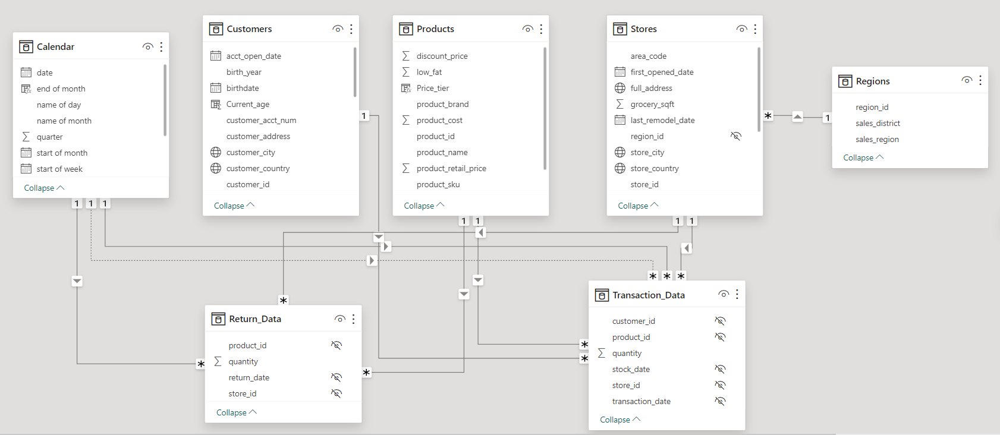
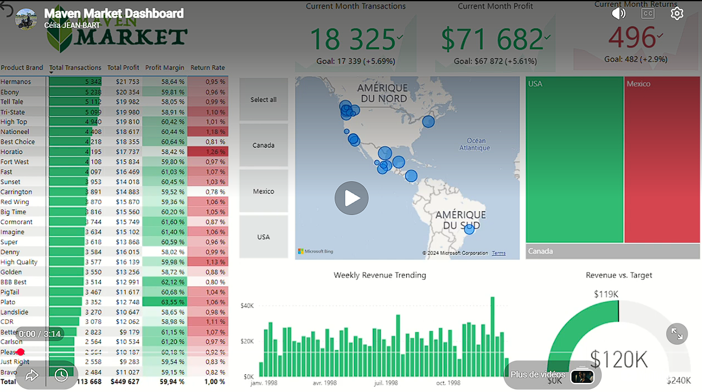

#  Maven Market BI: Global Grocery Analytics

## 📌 Project Overview

This project involves building an **end-to-end Business Intelligence solution** for Maven Market, a multinational grocery chain with locations in **Canada, Mexico, and the United States**.

I transformed raw transactional data into an **interactive reporting system** that tracks customer behavior, product performance, and regional trends.

---

## 🎯 Business Needs

Maven Market management required a **holistic view of global operations** to optimize supply chains and enhance customer experience. Key objectives:

* **Global Performance Tracking:** Overview of transactions and profits across three countries.
* **Customer Profiling:** Understanding demographics for personalized marketing.
* **Inventory & Returns:** Monitoring return rates to identify product quality issues.
* **Regional Benchmarking:** Compare store-level performance against revenue targets.

---

## 🏗️ Data Engineering & Modeling

To enable multi-national analysis, a **robust Star Schema** was designed:

* **ETL & Data Shaping:** Power Query (M) for cleaning customer records, formatting currency, and generating a dynamic Calendar table.
* **Relational Model:** 1:N relationships between Fact tables (Sales, Returns) and Dimension tables (Stores, Products, Customers, Regions).
* **Data Integrity:** Consistent data types and null handling to prevent skewed calculations across regions.

---
## 🖥️ Dashboard Preview

### 🎥 Project Demo

---

## 📈 DAX & Analytical Measures

Custom DAX measures provide **deep analytical insights**:

* **Time Intelligence:** Weekly revenue trends & Month-over-Month (MoM) growth.
* **Performance Metrics:** Revenue vs. Target gauges, Return Rate %.
* **Contextual Logic:** `CALCULATE`, `FILTER`, `ALL` to isolate regional performance regardless of global filters.

---

## 🎨 Interactive Features & UX

The dashboard emphasizes **user-centric reporting**:

* **Interactive Visuals:** Treemaps for country-level breakdowns, Geospatial maps for city-specific transactions.
* **Strategic Bookmarks:** Highlight key business milestones (e.g., Portland 1,000 Sales).
* **Dynamic Tooltips & Notes:** Contextual callouts for decision-makers without cluttering the view.

---

## 💡 Key Business Insights

* **Regional Success:** Mexico exceeded revenue targets by $10K in a month (+29.9% net profit).
* **Operational Excellence:** Canada had the best return management (42 returns in December, 28.81% below target).
* **Product Spotlight:** Hermanos product line drove both transactions and profit in Mexico.
* **Sales Milestones:** Portland identified as a high-growth hub after 1,000 sales in December.

---

## 🛠️ Tech Stack & How to Explore

* **Power BI Desktop:** End-to-end dashboard development.
* **Power Query (M):** Data cleaning and transformation.
* **DAX:** Advanced calculated measures and columns.

---

## 🖥️ Explore the Project

1. Clone this repository.
2. Open the `MavenMarket_Report.pbix` file using Power BI Desktop.
3. Use interactive bookmarks to navigate key business discoveries.
